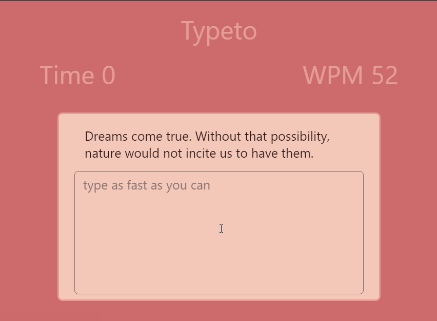
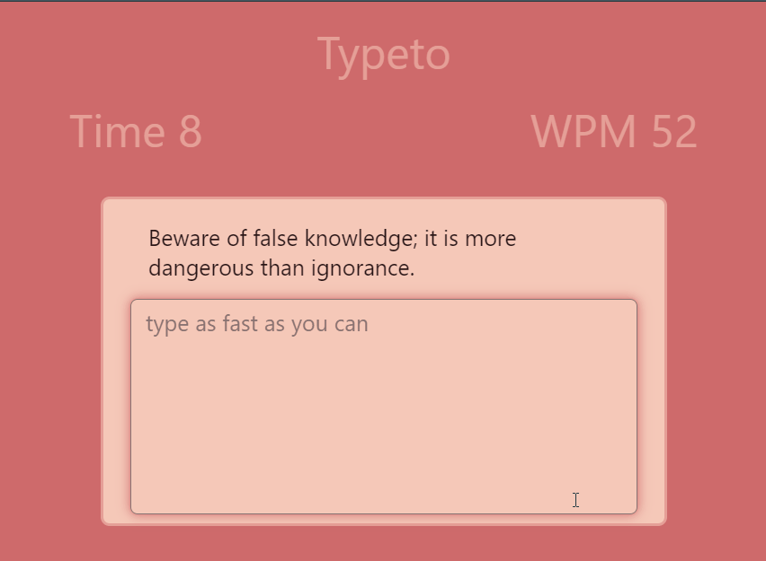
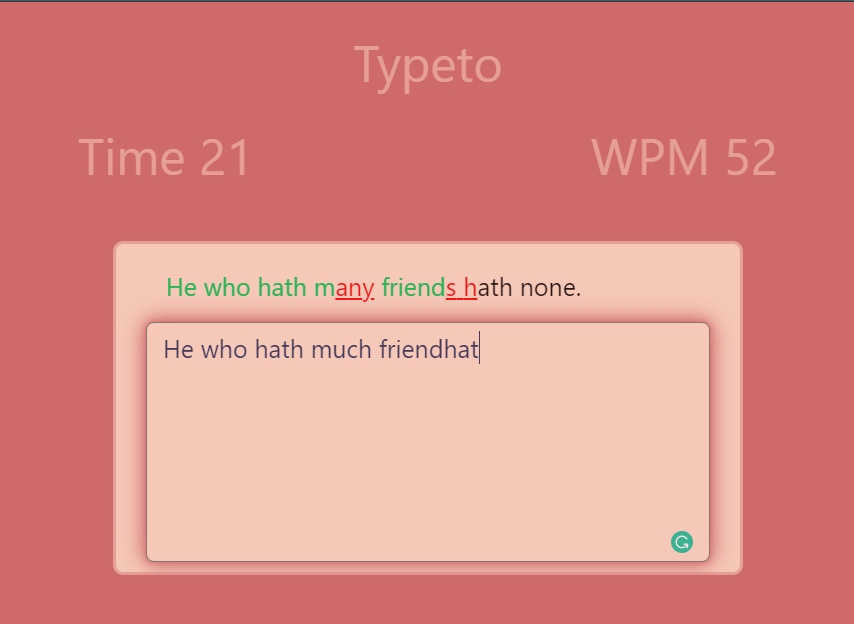

# ⌨ typeto

## 🔍 **About** [(try it)](https://adelrizq.github.io/typeto/)

⌨ speed typing app that helps you type **fast** and **correct**

## 🧐 **Concepts I learned**

1. handling localStorage object.
2. fetching an api end points.
3. some async js. 

## 📽 **Demo**

    
    

---

## 📷 **ScreenShots** 

  

## 👬 **Contributing**

> Contributions are what make the open source community such an amazing place to be learn, inspire, and create. Any contributions you make are **greatly appreciated**.

Check out our [contributing guidelines](https://github.com/AdelRizq/typeto) for ways to contribute.
